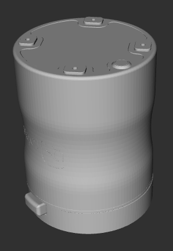
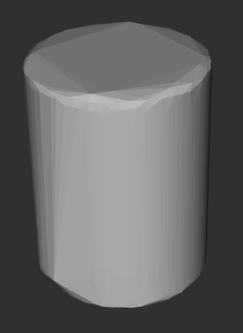

# OnRobot magnetic gripper

This package contains the URDF files describing OnRobot magnetic grippers (MG10).

```
roslaunch onrobot_mg_description disp_mg10_model.launch  
```

## Visual and Collision models
### MG10
    

## Reference
- To generate a collision model, you can use [rosmodelgen](https://github.com/takuya-ki/rosmodelgen)
